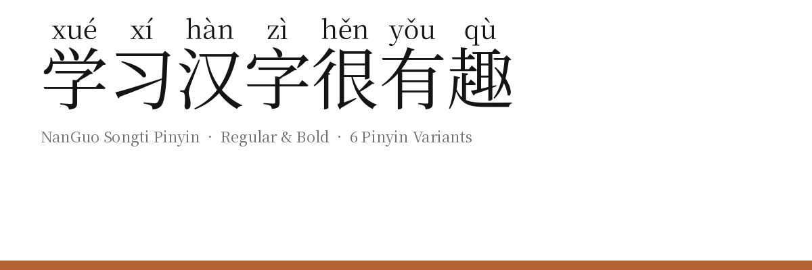

# NanGuo Pinyin Fonts

Pinyin ruby fonts for Simplified Chinese. Each Hanzi glyph is composited with its Hanyu Pinyin pronunciation rendered above it as native font geometry — no HTML `<ruby>` markup needed at render time.

Two families are provided:

| Family | Base font | Style |
|--------|-----------|-------|
| **NanGuo Heiti Pinyin** | Noto Sans SC | Sans-serif |
| **NanGuo Songti Pinyin** | Noto Serif SC | Serif |

Each family ships six TTFs (`-1` through `-6`) plus Bold variants, for 12 files per family. Variant `-1` carries the primary (most common) reading; variants `-2` through `-6` carry alternate readings for multi-pronunciation characters (多音字 — e.g. 行 xíng / háng). Characters with only one reading show that reading in every variant.




## Building

```bash
pip install -r requirements.txt
./build.sh
```

Built TTFs land in `fonts/Heiti/ttf/` and `fonts/Songti/ttf/`.

## Testing

```bash
pip install -r requirements-test.txt
python tests/run_all.py
```

## Repository layout

```
fonts/
  Heiti/ttf/          built NanGuoHeitiPinyin-{1..6}{,-Bold}.ttf
  Songti/ttf/         built NanGuoSongtiPinyin-{1..6}{,-Bold}.ttf
sources/
  Heiti/base-font/    NotoSansSC-Regular.ttf, NotoSansSC-Bold.ttf
  Songti/base-font/   NotoSerifSC-Regular.ttf, NotoSerifSC-Bold.ttf
  data/               pinyin_map.json, heteronym_map.json, syllable_inventory.json, …
  scripts/            make_pinyin_font_v2.py and supporting utilities
documentation/        specimen images
```

## License

This Font Software is licensed under the [SIL Open Font License, Version 1.1](OFL.txt).

Font data derived from Noto CJK fonts, Copyright 2014–2021 Google LLC (OFL 1.1).
